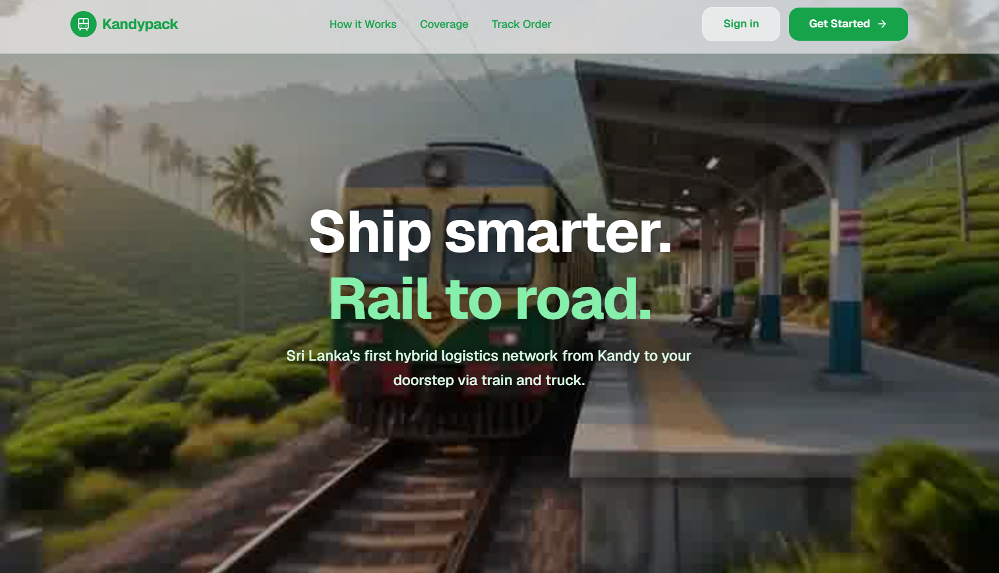
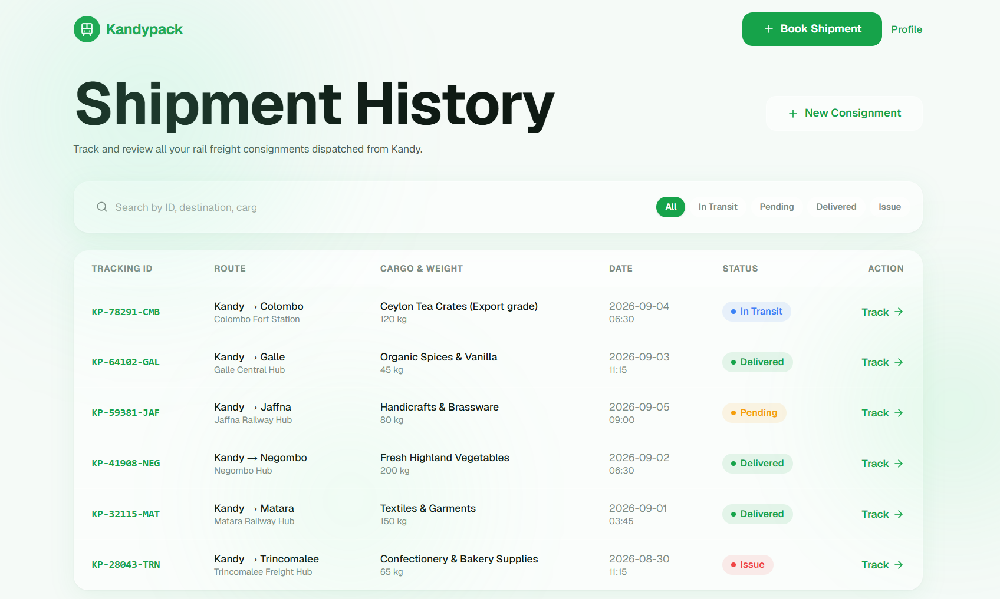

<div align="center">

# 🚂 KANDYPACK.LK 🚂


### Rail & Road Based Supply Chain Distribution System

*From Kandy to the coast - one seamless journey, tracked in real time.*

[](https://nextjs.org/)
[](https://www.typescriptlang.org/)
[](https://tailwindcss.com/)
[](https://gsap.com/)
[](https://www.framer.com/motion/)

[]()
[]()

**[Live Demo](#) · [Design System](./DESIGN.md) · [Report an Issue](../../issues)**

</div>

<br/>

## 📚 Table of Contents

- [About](#-about)
- [Preview](#-preview)
- [Highlights](#-highlights)
- [Tech Stack](#️-tech-stack)
- [Getting Started](#-getting-started)
- [Project Structure](#-project-structure)
- [Design System](#-design-system)
- [Team](#-team--group-20)
- [License](#-license)

---

## 🌿 About

**Kandypack** replaces a legacy Excel based logistics workflow with a modern,
database-driven distribution platform shipping FMCG goods from Kandy to six
regional hubs (**Colombo · Negombo · Galle · Matara · Jaffna · Trincomalee**) by
train, then completing last mile delivery by truck.

This repository holds the **public customer facing frontend** the landing
experience and core customer app (auth, ordering, live tracking, order
history) built to feel like a premium, modern product, not a legacy
enterprise tool.

> 🎓 Built as part of the **CS3043 Database Systems** module project,
> CSE Batch 24, University of Moratuwa - **Group 20**.

---

## 🎬 Preview

<div align="center">


*The signature scroll scrubbed hero scrolling plays through the shipment's journey like a video*

<br/><br/>




*Landing page (left) · Real time order tracking timeline (right)*

</div>

---

## ✨ Highlights

| | |
|---|---|
| 🟢 **Light Green Glass** design system | Soft glassmorphism panels floating over animated aurora gradient backgrounds |
| 🎬 **Scroll scrubbed cinematic hero** | A photo sequence that plays like a video as you scroll Apple product page style |
| 🧊 **Consistent glass UI** | Every surface nav, cards, forms, modals follows one documented component pattern |
| 🎞️ **Motion throughout** | Staggered scroll reveals, spring hover states, animated count up stats, animated order tracking timeline |
| ♿ **Accessible by default** | Full `prefers-reduced-motion` + mobile fallback support no one is stuck loading something they didn't ask for |
| 📱 **Fully responsive** | Mobile-first from the ground up |

---

## 🛠️ Tech Stack

| Layer | Technology |
|---|---|
| Framework | [Next.js 14+](https://nextjs.org/) (App Router) |
| Language | TypeScript |
| Styling | Tailwind CSS (custom green design tokens) |
| Animation | Framer Motion (`motion`) + GSAP ScrollTrigger |
| Smooth Scroll | Lenis |
| Icons | lucide-react |

The full visual language colors, glass rules, typography, motion, do's &
don'ts lives in [`DESIGN.md`](./DESIGN.md). Any AI coding agent (or human!)
working on this repo should read that first.

---

## 🚀 Getting Started

```bash
# clone the repo
git clone https://github.com/KandyPackGroup20/FrontEnd_2.0.git
cd FrontEnd_2.0

# install dependencies
npm install

# run the dev server
npm run dev
```

Open [http://localhost:3000](http://localhost:3000) to view it.

---

## 📁 Project Structure

## Project Structure

```
FrontEnd_2.0/
├── app/                       # Next.js App Router pages
│   ├── page.tsx               # Landing page
│   ├── layout.tsx             # Root layout
│   ├── globals.css            # Global styles + Tailwind layer
│   ├── login/                 # Auth screens
│   ├── register/
│   ├── order/                 # Multi-step order flow
│   ├── orders/                # Order history + live tracking
│   └── profile/                # Account & saved addresses
│
├── components/                 # Reusable UI
│   ├── hero/                   # Scroll-scrubbed sequence hero
│   ├── sections/                # Landing page sections
│   └── ui/                      # Shared glass UI primitives
│
├── public/
│   ├── images/
│   │   └── sequence/            # Hero scroll-sequence frames (120)
│   └── icons/                   # Feature & step icons
│
├── DESIGN.md                    # 🎨 Design system reference
├── AGENTS.md                    # Instructions for AI coding agents
├── CLAUDE.md                    # Claude-specific agent context
├── README.md                    # You are here
├── next.config.ts               # Next.js configuration
├── tsconfig.json                # TypeScript configuration
├── tailwind.config.ts           # Tailwind theme (green tokens live here)
├── postcss.config.mjs           # PostCSS config (Tailwind pipeline)
├── eslint.config.mjs            # Linting rules
├── package.json                 # Dependencies & scripts
├── package-lock.json            # Locked dependency versions
└── .gitignore                   # Files excluded from git
```


> 🤖 **What are `AGENTS.md` and `CLAUDE.md`?** This project was built in
> close collaboration with AI coding agents (Google Antigravity), which
> generate these files to keep track of project specific build conventions
> across sessions. `DESIGN.md` is the one that actually matters for
> contributors it's the design system spec both humans and agents follow.

---

## 🎨 Design System

This project follows a documented design system rather than ad hoc styling
see [`DESIGN.md`](./DESIGN.md) for the full spec:

- 🎨 Color tokens & roles
- ✍️ Typography scale
- 🧊 The `.glass` component pattern
- 🎞️ Motion language & easing rules
- 📱 Responsive & accessibility behavior

---

## 👥 Team - Group 20

<div align="center">

| Member | Focus Area |
|---|---|
| **Gunasekara P.S.I** | Identity, Access & Security |
| **Kethmika K.A.D.Y.** | Rail Capacity Allocation & Spillover |
| **Praghathees K.** | Truck Roster & Driver Assignment Engine |
| **Indrasiri K.B.S.H.** | Station Inventory & Warehouse Operations |
| **Sewwandi P.D.Y.** | Reporting, Analytics & QA |

*Department of Computer Science & Engineering, University of Moratuwa*

</div>

---

## 📜 License

This project is built for academic purposes as part of CS3043 - Database
Systems. All rights reserved by Group 20 unless otherwise stated.

---

<div align="center">

**Built with 💚 and a lot of scroll-jank debugging.**

<sub>⭐ Star this repo if you liked the scroll effect</sub>

</div>
